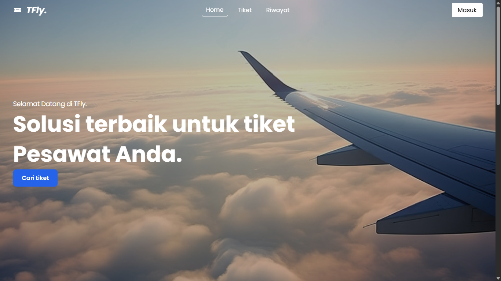
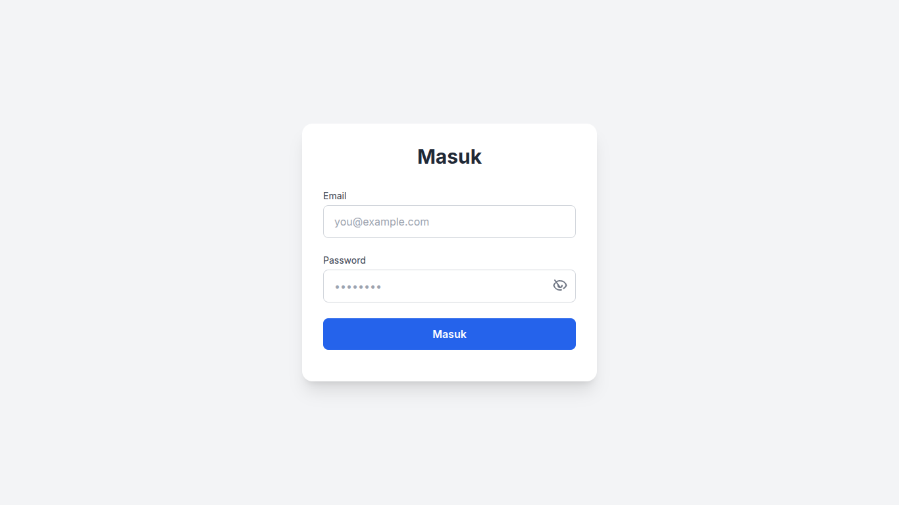
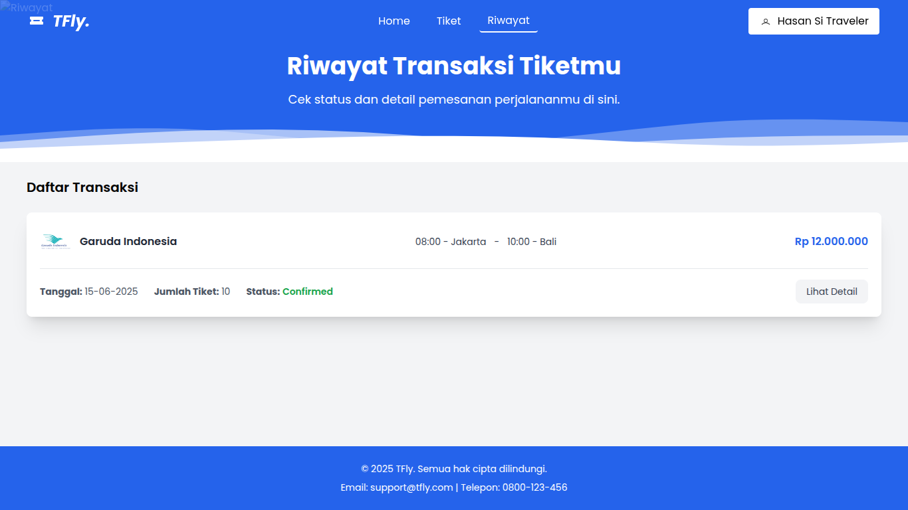
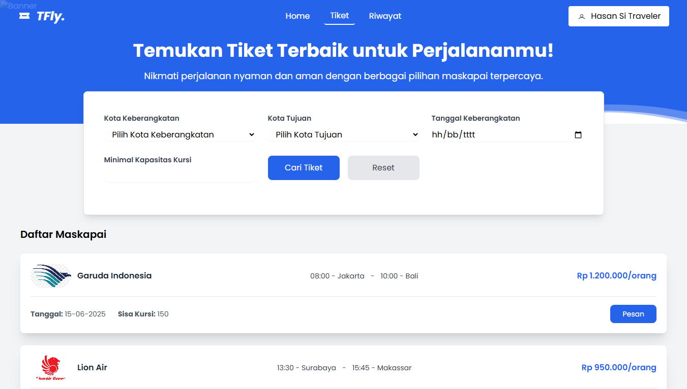

# ✈️ Online Flight Ticket Booking Website

This is a simple and modern web application built for booking flight tickets online. It is designed to help users search for available airlines and manage their booking history with ease. The project is still under development and currently includes basic core features.

## 🌐 Features

- 🔐 **Login System**  
  Users can log in to access ticket history and booking details. *(Note: Register functionality is not yet implemented.)*

- ✈️ **Airline Search**  
  Users can search for available airline flights based on specific criteria.

- 📜 **Purchase History**  
  Users can view their past flight ticket bookings in the "Riwayat" (History) section.

- 🎟️ **Ticket Management**  
  After booking, users can view detailed ticket information directly on the platform.

## 🖼️ Screenshots

### 🏠 Home

### 🔐 Login

### 📜 Booking History

### 🎟️ Ticket Information

## 🚧 Status

This project is still under development. More features, such as user registration and real-time flight integration, will be added in future updates.
